# house_price_prediction

**Author**: [Jin-hoon Chung](mailto:ddjh204@gmail.com)

## Overview

This project shows how a house price can be estimated. Many features of a house are taken into the account for this estimation. Some visualizations are included to aid in understanding the progress.

## Business Problem

A realtor wants to help customers sell their houses. The realtor uses housing information to make houses' price estimations using a prediction model.

## Data Understanding

This project uses the King County House Sales dataset. The dataset has around 20 columns. Several columns will be removed as they are less likely to be helpful in price estimation.

## Data Preparation

The steps are briefly explained. Please refer to the EDA notebooks for the detailed steps.

### Handling Missing Values

Missing values from three columns, waterfront, view, and yr_renovated, are removed.

The "waterfront" column has two values, 'NO' and 'YES'. The missing values are converted to 'NO'.
The "view" column has values of four ratings and 'NONE'. The missing values are converted to 'NONE'.
The "yr_renovated" column has values of years and zeroes where zeroes mean the house has not been renovated. The missing values are converted to zeroes. Then, a new binary column is created to store information if the house is renovated or not.

### Basic cleaning

Several columns are modified for better data quality and less complexity of analysis.

- The "view" column is updated to a binary column.
- The "condition" column has values of ratings. Ratings with relatively low counts are combined to reduce variance.
- The "grade" column has values of ratings. The same modification done to the "condition" column is applied to this column.
- The "sqft_basement" column has zeroes and missing values. This column is converted to a binary column to store if the house has a basement or not.

### Cleaning for Numerical Columns - Log Transformation and Normalization

Values in the numerical columns are log-transformed and scaled using normalization. This process secures normal distribution and balanced scales for all numerical columns.

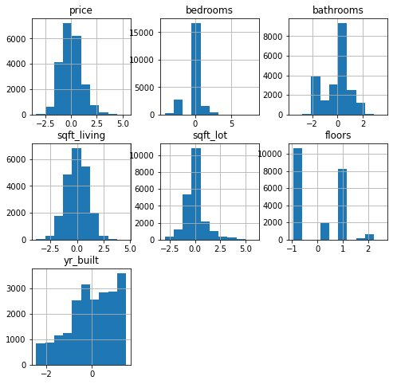

### Cleaning for Categorical Columns - Encoding Binaries and Multi-categories

The binary columns are encoded as 1's and 0's. 

The columns with multiple categories are transformed into the same number of binary columns as **the number of categories minus 1**. The first binary column is removed to reduce multicollinearity.

### Final Concatenation

Numerical columns and categorical columns are merged to form the final data.

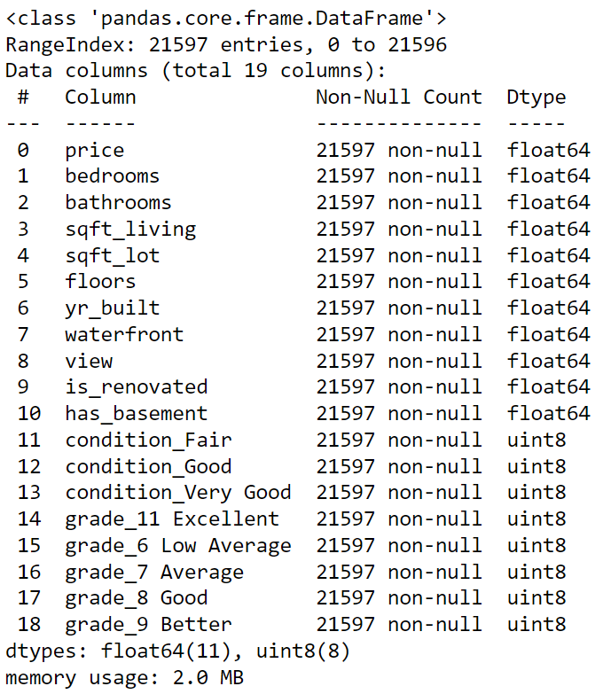

## Analysis

Before the analysis, the data is split into train set and test set. The train set size is 75% of the whole data. This step would help validate a model.

### Multicollinearity

Multicollinearity is checked using heatmap.

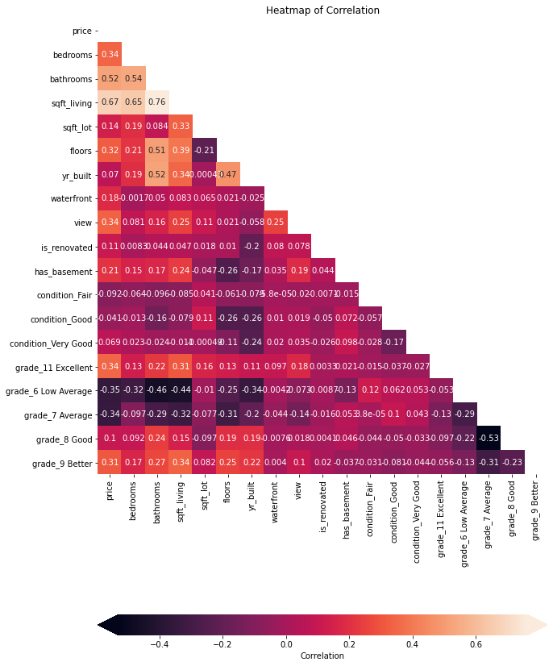

### The Final Model

Please refer to **EDA - Model Validation**  and **EDA - Interaction** for the details on validating the final model. The columns for bathrooms and bedrooms are removed, and then an interaction column is added to increase the R-squared score.

Train score:      0.6532701480220614

Validation score: 0.6523981556506147

X-test score:     0.6352544653210463

R2 score:         0.6352544653210463

Mean^2 Error:     0.601024386635919

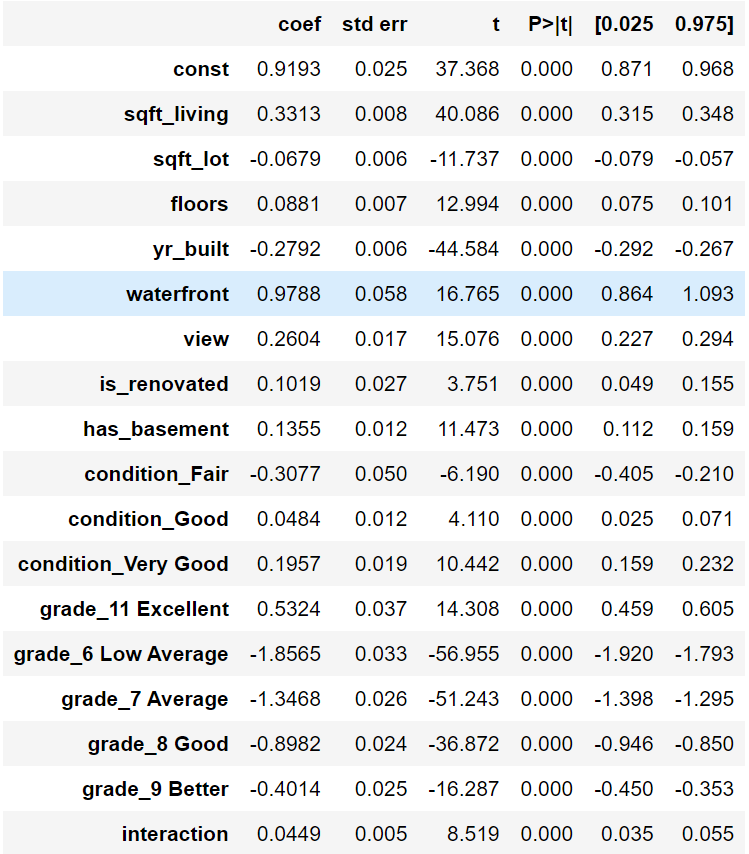

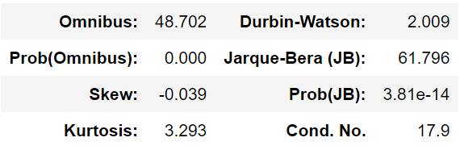

The overall scores are very similar to the previous result while the condition number is much lowered. P-value of each coefficient are critical.

### Assumption Checks

**1. Linearity**

The below graph shows a faily linear line. The assumption of linearity can be held.

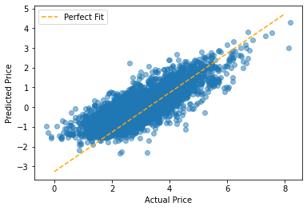

**2. Normality**

QQ-plot shows a slight skewness, but most values are close to the line. This holds the normality assumption.

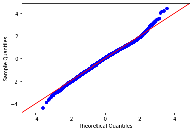

**3. Multicollinearity**

No values are above 5. It seems the "sqft_living" column has some dependency, but it is not critically high to reject the assumption.

|sqft_living            |3.001670|
|sqft_lot               |1.552016|
|floors                 |2.046914|
|yr_built               |1.758294|
|waterfront             |1.086293|
|view                   |1.313341|
|is_renovated           |1.148279|
|has_basement           |2.441147|
|condition_Fair         |1.042169|
|condition_Good         |1.647135|
|condition_Very Good    |1.281906|
|grade_11 Excellent     |1.278034|
|grade_6 Low Average    |1.939542|
|grade_7 Average        |2.077564|
|grade_8 Good           |1.609822|
|grade_9 Better         |1.440610|
|interaction            |1.374175|

**4. Homoscedasticity**

There is a slight pattern on the right side of the plot, but overal it is not easy to detect a clear pattern. The assumption holds.

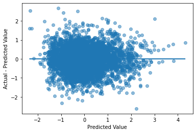

### Value Prediction

Example values are set for the analysis in the below dictionary. The assigned values can be modified for a different result.

'sqft_living': 2000

'sqft_lot': 5000

'floors': 3

'yr_built': 2000

'waterfront': 0

'view': 0

'is_renovated': 0

'has_basement': 0

'condition_Fair': 0

'condition_Good': 0

'condition_Very Good': 0

'condition_Average': 1

'grade_11 Excellent': 0

'grade_6 Low Average': 0

'grade_7 Average': 1

'grade_8 Good': 0

'grade_9 Better':0 

'grade_10 Very Good':0

The estimated price of a house with the example features is **$382,360.**

Using example values assigned to the features, several graphs are shown below. For each graph, one feature is selected and assigned with a range of values to measure the expected trend.

- **The house price is expected to increase as the living area increases.**

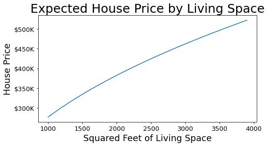

- **The house price is expected to increase with a higher number of floors.**

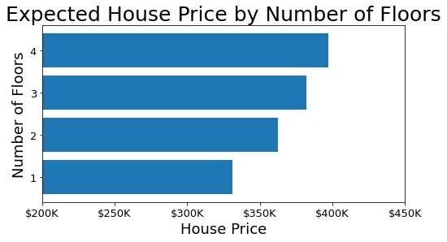

- **The house price is expected to increase with better maintenance.**

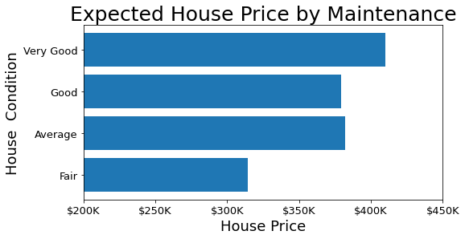

- **The renovated houses tend to have a higher price.**

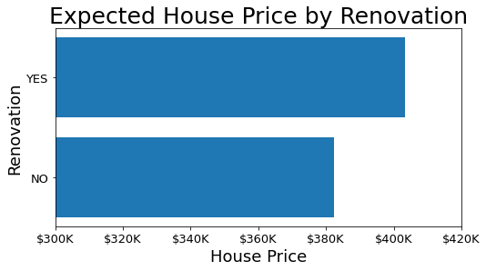

## Conclusions

- **The house price tends to increase as living space and the number of floors increase.**
- **The higher price is observed for better conditions.**
- **The renovated houses have a higher price.**
- **The higher price is observed for higher grades.**
- **There is a minor negative impact on the price as the lot size increases.**

### Next Steps

Further analysis could help customers gain more insight into estimating a house price.

- **Run the analysis again using bedroom and bathroom counts without living space.** The current analysis excluded information on bedrooms and bathrooms because of collinearity. Some customers would be interested in price estimation based on bedrooms and bathrooms.
- **Run the analysis again on a specific region.** The current analysis ignores latitude and longitude to reduce complexity. Instead of including location information in the regressional model, we can set a limit for latitude and longitude before validating a model.
- **Use information from a different county.** This analysis uses information from a specific county. It would be ideal to compare the house values with the same example values in a close-by county.

## Repository Structure

```
├── code
│   ├── __init__.py
│   ├── data_preparation.py
│   ├── visualizations.py
│   ├── EDA_cleaning.ipynb
│   ├── EDA_Interaction.ipynb
│   └── EDA_Model_validation.ipynb
├── data
├── images
├── __init__.py
├── README.md
├── House_Price_Prediction.pdf
└── House_price_prediction.ipynb
```